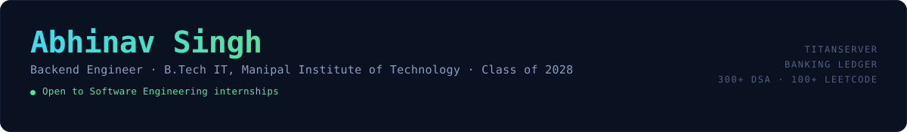
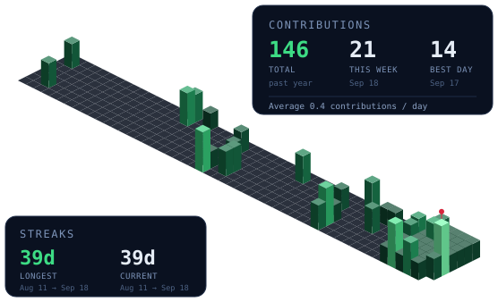

 

<table>
<tr>
<td width="22%" align="center">

</td>
<td width="78%">

I'm a pre-final year IT student who likes backend systems — the kind of code where correctness under failure matters more than anything else. Two projects anchor most of what I do: **TitanServer**, a concurrent C++ server framework, and my **Banking Ledger**, a payments backend built around immutable double-entry records. Outside of that, I've dabbled in quant modelling, ML, and a fair amount of competitive programming.

🎓 Manipal Institute of Technology, Bengaluru — CGPA 8.52/10 &nbsp;·&nbsp; 🧑‍🏫 EducationLead, Quantus (Quantum Computing Club) &nbsp;·&nbsp; 📜 Certified in Data Analysis, HKUST &nbsp;·&nbsp; 🏆 300+ DSA, 100+ LeetCode

</td>
</tr>
</table>

---

### What I've built

<table>
<tr>
<td width="50%" valign="top">

**⚡ [TitanServer](https://github.com/abhinav0singh/TitanServer)**
Concurrent C++ server framework — `C++17` `std::thread` `CMake`

- Fixed a socket shutdown bug causing ~50% request failures; error rate to zero across 228k requests
- Diagnosed TIME_WAIT exhaustion, added keep-alive: **3,084 → 42,558 req/s (13.8×)**, p99 **6,691ms → 15ms**
- Traced a logging bottleneck to a mutex-guarded flush; gated it behind an atomic check for **11.5×** on static serving

</td>
<td width="50%" valign="top">

**🏦 [Banking Ledger](https://github.com/abhinav0singh/BankingTransactionSystem)**
RESTful payments backend — `Node.js` `Express` `MongoDB` `JWT`

- Modelled money as an **immutable double-entry ledger** — balances derived, never mutated, fully auditable
- **Idempotency keys** so a retried or duplicated request returns the original result, never a double-charge
- Multi-step transfers kept consistent with MongoDB sessions; JWT auth, bcrypt hashing, protected routes

</td>
</tr>
</table>

Also on GitHub: [Monte Carlo VaR/CVaR](https://github.com/abhinav0singh/Monte-Carlo_VaR_CVaR) · [Bangalore House Prices](https://github.com/abhinav0singh/Bangalore-house-Price-Prediction) · [java-visual-memory-trainer](https://github.com/abhinav0singh/java-visual-memory-trainer) · [→ all 31 repos](https://github.com/abhinav0singh?tab=repositories)

---

### Contributions

---

