<table>
<tr>
<td width="30%" align="center">

</td>
<td width="70%">

### Hello — I'm Abhinav

I'm a pre-final year Information Technology student at Manipal Institute of Technology, and a backend engineer who cares about correctness under failure more than almost anything else.

My banking ledger models money as an **immutable double-entry ledger** — balances are derived, never mutated — with **idempotency keys** so a retried request can never double-charge anyone. TitanServer is the same instinct pointed at the systems layer: I profiled it under load, found sockets dying mid-write, fixed the shutdown path, then chased the next bottleneck, and the next — **3,084 → 42,558 req/s**, p99 latency **6,691 ms → 15 ms**.

**Seeking:** a Software Engineering internship — reliable, developer-facing financial infrastructure.

</td>
</tr>
</table>

- 🎓 B.Tech Information Technology, **Manipal Institute of Technology, Bengaluru** — CGPA 8.52/10, Class of 2028
- 🧑‍🏫 **EducationLead, Quantus** (Quantum Computing Club) — ran workshops, mentored juniors, coordinated events
- 📜 **Certified in Data Analysis** — Python & Statistics for Financial Analysis, HKUST via Coursera
- 🏆 **300+ DSA problems solved**, 100+ on LeetCode — graphs, trees, DP, greedy, binary search

## The work

### ⚡ [TitanServer](https://github.com/abhinav0singh/TitanServer) — concurrent C++ server framework

`C++17` `std::thread` `CMake`

- Load-tested the server and found **~50% of requests failing** — `closesocket()` on a socket with unread data sends a TCP RST instead of a FIN. Fixed with a graceful `shutdown()` + drain; **error rate to zero across 228k requests**.
- Diagnosed a 15,495-socket TIME_WAIT buildup eating 95% of the OS's ephemeral port range in 15 seconds. Implemented HTTP keep-alive: **3,084 → 42,558 req/s (13.8×)**, **p99 latency 6,691 ms → 15 ms**.
- Profiled the remaining hot path to a mutex-guarded `std::cout` flush on every request. Gated logs behind an atomic level check: **5,138 → 59,182 req/s (11.5×)** on static file serving.
- Documented the fixed-thread-pool ceiling (8 threads → 8 concurrent connections, the C10K wall). Next step: IOCP-based event-driven I/O.

 

### 🏦 [Banking Ledger](https://github.com/abhinav0singh/BankingTransactionSystem) — RESTful payments backend

`Node.js` `Express` `MongoDB` `JWT` `Nodemailer`

- Built a RESTful money-movement backend — accounts, transfers, balances — on a modular routes → controllers → services → models architecture, so business logic doesn't know or care how it's transported or stored.
- Modelled money as an **immutable double-entry ledger**: every transfer writes paired debit/credit entries as the single source of truth. Balances are derived, never mutated, and history stays fully auditable.
- **Idempotency keys** mean a retried or duplicated request returns the original result instead of double-charging — transfers stay exactly-once safe across retries and flaky networks.
- Multi-step transfers stay consistent via MongoDB sessions/transactions; balances are derived from ledger records with aggregation pipelines.
- Stateless JWT auth, bcrypt password hashing, custom validation middleware, protected routes, and Nodemailer for transaction notifications.

<b>A few other things I've built</b>

 

- [Monte Carlo VaR / CVaR](https://github.com/abhinav0singh/Monte-Carlo_VaR_CVaR) — tail-risk estimation via simulated price paths (`Python`)
- [Bangalore House Prices](https://github.com/abhinav0singh/Bangalore-house-Price-Prediction) — regression on real, messy listing data (`Jupyter`, `scikit-learn`)
- [java-visual-memory-trainer](https://github.com/abhinav0singh/java-visual-memory-trainer) — a small memory-training game (`Java`)

<a href="https://github.com/abhinav0singh?tab=repositories"><b>→ All 31 repositories</b></a>

## The toolkit

<b>🔧 Everything else, straight off the resume</b>

 

| Layer | Tools |
|---|---|
| **Backend** | Node.js, Express.js, REST APIs, JWT Authentication |
| **Databases** | PostgreSQL, MongoDB, Redis |
| **Tools & practices** | Git, GitHub, Docker, Linux, Postman, unit testing, secure coding |
| **CS fundamentals** | DSA, OOP, DBMS, Operating Systems, Computer Networks, multithreading & concurrency, SDLC, Agile |

<b>📚 What's next</b>

 

- **IOCP-based event-driven I/O** — breaking TitanServer past the fixed-thread-pool C10K ceiling
- **Ledger v2** — deeper audit trails on top of the double-entry model
- **The next 100 on LeetCode** — 300+ solved and counting

<b>🧭 How I like to work</b>

 

**Measure before optimising.** Every number on this page came from a profiler, not a guess.

**Small, reviewable commits.** Future-me is a stranger with no context and no patience.

**Write it down.** If a design decision isn't in the README, it didn't happen.

**Boring is a feature.** Clever code is a debt you pay at 2 a.m.

## The record

 

Each building is one week. Height is how much I shipped. The snake just lives here — it isn't eating anything.

## Get in touch

If you're building something that has to stay up, or a ledger that has to stay right — I'd like to hear about it.

 

